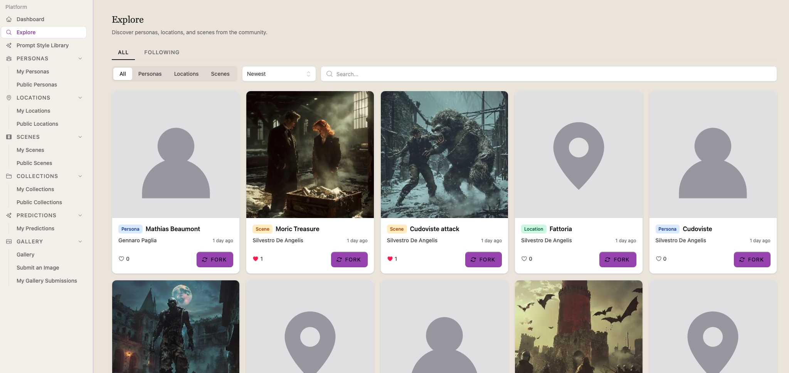
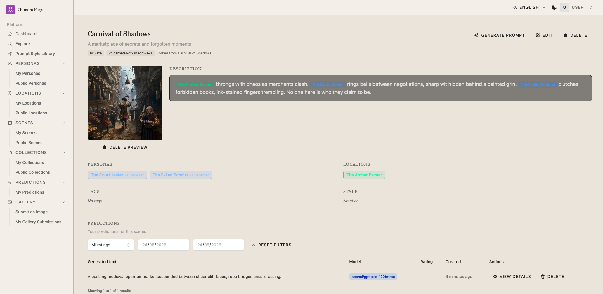
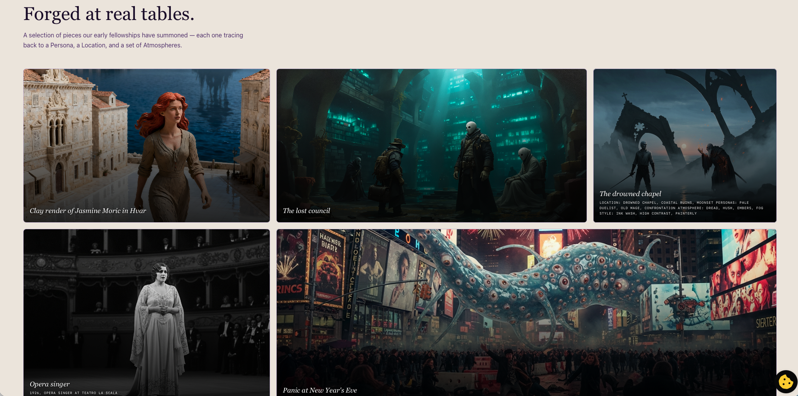

*This post was translated from Italian with the help of Claude.*

---

I've been playing tabletop RPGs with my current group for six years. We started online because the group is spread across Rome, Naples and Brazil. One evening a week, almost always, and I've never been bored. One of the things I've always loved, both as a game master and as a player, is imagining and describing scenes: when it works, what happens during a session becomes almost a real memory, and days later the players retell it with the same casualness of recounting a weekend at the beach. That feeling is worth more than anything else.

In 2023 I started experimenting with the first image generators. Stable Diffusion ran on my Mac in relatively acceptable times, a couple of minutes per image, and that was already enough for me. While the game master described the scenes, I tried to assemble a prompt on the fly that captured what they were narrating, then drop it into our WhatsApp group during the session. The results were pretty rough, partly because the models back then weren't great, and partly because I was still learning how to put together a decent prompt.

Over time I figured something out: it's not the one right word that makes the difference, it's the overall structure. How you set the atmosphere, how you describe the light, how you balance character details with the environment. I refined the technique, accumulated prompt fragments, description snippets, atmosphere settings. And along with them I accumulated the opposite problem: a chaotic archive of text scattered everywhere, tedious to reassemble every single time.

The partial solution was a meta-prompt for an LLM: instructions on how to behave as a prompt engineer specialised in image generators. It worked reasonably well, especially because in a sequence of follow-up requests it remembered the context and you could say "modify this scene, the protagonist does this other thing" without starting from scratch. The problem was that as soon as you switched to a completely different scene, most of the parameters had to be re-entered. And keeping that chat window open with all the rebuilt context every time was as inconvenient as the original problem.

The real solution was a structured archive: a place to save the base descriptions of characters, objects and locations, and a scene where you reference those elements via tags. The system would automatically reassemble the full description, feed everything to an LLM with the right instructions, and out would come a prompt optimised for image generators. It wasn't a complicated idea. I built it.

The system is called **Chimera Forge**, which is the mythological beast made of different parts plus the forge where prompts get assembled. Available at [chimera-forge.it](https://chimera-forge.it).

In practice it works like this: you create your library of characters, objects and locations, each with its own description. Then you create a scene, describe it, and inside the description you use tags that reference elements from the library. Chimera Forge uses an LLM to turn all this into a prompt optimised for image generators, including the complete descriptions of every referenced element. The result is visual consistency across scenes that share the same characters or locations, without having to rewrite everything from scratch each time or rely on a chat's memory.

If the character is a tall, blonde American with blue eyes and an athletic build, that description lives in the library exactly once. Every scene that includes them carries it along automatically. Every generated prompt will be consistent with the others. You can regenerate it as many times as you want, feed the same prompt to multiple generators and see how each one interprets it differently.

To build it I used Laravel as the framework, MariaDB, Redis for cache and sessions. I leaned heavily on Claude Code for writing the code, but in a specific way: by writing precise specs, breaking tasks down, with very detailed tests. It wrote more tests than I would have on a system I know well and could modify myself. I didn't want a black box. I wanted code I understand, that I can touch, that doesn't make me dependent on an agent for every future change. That's how it came out. I adjusted some things by hand, ran some tests manually. The coding agent accelerated, not replaced.

The frontend was the most interesting part, in the sense that I've always had a rocky relationship with frontend work. I can easily picture a functional and pleasant interface; the gap between that and actually writing the code to realise it is my Achilles heel. That's where Claude Code made the biggest difference.

While building the system a few features came to mind that I hadn't planned.

The first is grouping content into collections, useful when a campaign grows and elements start to multiply.

Then forking, borrowed straight from the open source world: if someone creates a character or location and makes it public, you can reuse it directly in your scenes, or make a copy in your own library and modify it however you like.

From there a public exploration page came naturally, showing the most recent public content and likes. And when you open things up to the public you always have to plan for moderation: I added content reporting and a mechanism for proposing a generated image to the homepage gallery, which an administrator reviews before publishing.

The system is not professional, it's free, it was born out of passion and for people who play tabletop RPGs. I intend to keep it that way. The LLM that generates the prompts uses one of the free tiers available on OpenRouter. For scenes there's also the option to generate a preview, 256x256, low quality, just to get an idea of what the prompt will produce. It doesn't collect personal data, the captcha is an open source system running directly on my server without external libraries, and I'll be moving the email sending in-house soon as well.

Registrations are currently invite-only. If you want to try it there's a form on the site to request a code, I'll send it as soon as I read the email.

There's still work to do, especially on the less fun part: if you have advice on how to write a better privacy policy and terms and conditions, it's very welcome.

---

### [Try Chimera Forge at chimera-forge.it](https://chimera-forge.it)
