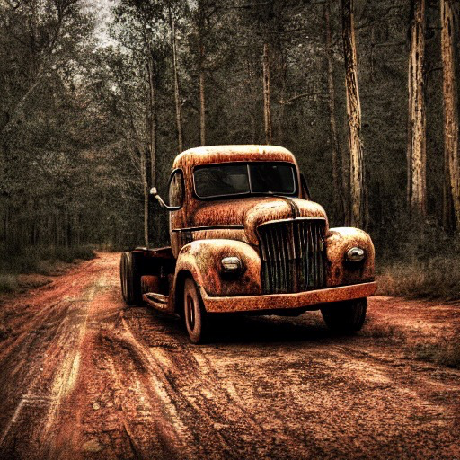
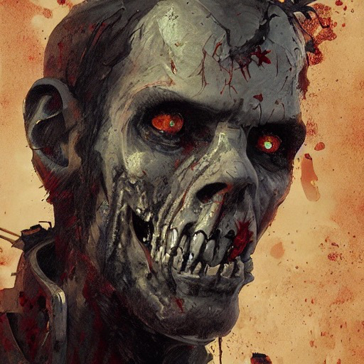
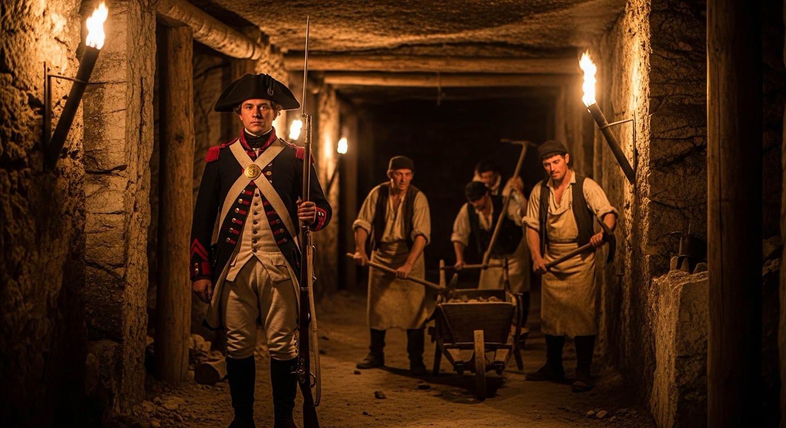
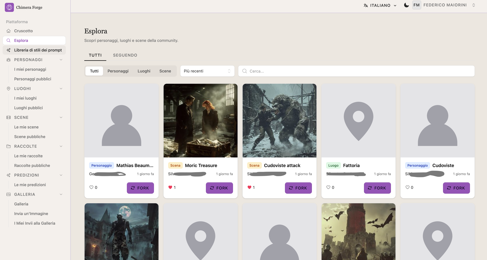
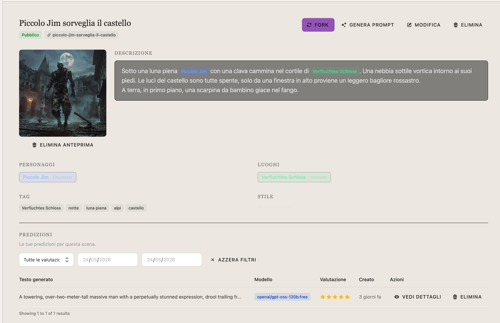
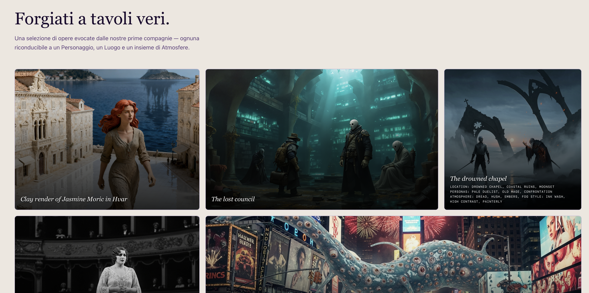

Gioco di ruolo da sei anni con un gruppo distribuito tra Roma, Napoli e il Brasile. Online, una sera a settimana quasi sempre, e non mi è mai capitato di annoiarmi. Una delle cose che mi è sempre piaciuta, da master e da giocatore, è immaginare e descrivere le scene: quando funziona, quello che succede durante una partita diventa quasi un ricordo reale, e nei giorni successivi i giocatori se lo raccontano con la stessa leggerezza con cui si racconta un weekend al mare. Quella cosa lì vale più di qualsiasi altra cosa.

Dal 2023 ho cominciato a sperimentare con i primi generatori di immagini. Stable Diffusion girava sul mio Mac in tempi relativamente accettabili, un paio di minuti a immagine, e per me era già abbastanza. Mentre il master descriveva le scene, io cercavo di assemblare al volo un prompt che catturasse quello che stava raccontando, per poi buttarlo nel nostro gruppo WhatsApp durante la partita stessa. I risultati erano abbastanza grezzi, sia perché i modelli dell'epoca non erano granché, sia perché stavo ancora imparando come si costruisce un prompt decente.

Col tempo ho capito qualcosa: non è la singola parola giusta a fare la differenza, è la struttura complessiva. Come imposti l'atmosfera, come descrivi la luce, come bilanci i dettagli dei personaggi con quelli dell'ambiente. Ho affinato la tecnica, ho accumulato frammenti di prompt, pezzetti di descrizione, impostazioni dell'atmosfera. E con loro ho accumulato il problema opposto: un archivio caotico di testo sparso ovunque, faticoso da rimettere insieme ogni volta.

La soluzione parziale è stata un meta-prompt per un LLM: istruzioni su come comportarsi da prompt engineer specializzato in generatori di immagini. Funzionava discretamente, soprattutto perché in una sequenza di richieste successive ricordava il contesto e potevi dire "modifica questa scena, il protagonista fa quest'altra cosa" senza ricominciare da zero. Il problema è che appena cambiavi completamente scena, la maggior parte dei parametri andava reinserita. E tenere aperta quella finestra di chat con tutto il contesto ricostruito ogni volta era scomodo quanto il problema originale.

La soluzione vera era un archivio strutturato: un posto dove salvare le descrizioni base di personaggi, oggetti e location, e una scena in cui fare riferimento a quegli elementi tramite tag. Il sistema avrebbe ricomposto la descrizione completa automaticamente, avrebbe dato tutto in pasto a un LLM con le istruzioni giuste, e ne sarebbe uscito un prompt ottimizzato per il generatore di immagini. Non era un'idea complicata. L'ho costruita.

Il sistema si chiama **Chimera Forge**, che è il mostro mitologico fatto di parti diverse più la forgia in cui i prompt vengono assemblati. Disponibile su [chimera-forge.it](https://chimera-forge.it).

In pratica funziona così: crei la tua libreria di personaggi, oggetti e location, ognuno con la sua descrizione. Poi crei una scena, la descrivi, e dentro la descrizione usi dei tag che fanno riferimento agli elementi della libreria. Chimera Forge usa un LLM per trasformare tutto questo in un prompt ottimizzato per i generatori di immagini, includendo le descrizioni complete di ogni elemento referenziato. Il risultato è una coerenza visiva tra le scene che contengono gli stessi personaggi o luoghi, senza dover riscrivere ogni volta tutto o affidarsi alla memoria di una chat.

Se il personaggio è un americano biondo, alto, occhi azzurri, fisico atletico, quella descrizione è nella libreria una volta sola. Ogni scena che lo include la porta dietro automaticamente. Ogni prompt generato sarà coerente con gli altri. Puoi rigenerarlo quante volte vuoi, puoi darlo in pasto a più generatori per vedere come lo interpretano diversamente.

Per costruirlo ho usato Laravel come framework, MariaDB, Redis per cache e sessioni. Ho usato pesantemente Claude Code per scrivere il codice, ma in un modo specifico: scrivendo specifiche precise, dividendo i task, con test molto dettagliati. Ne ha scritti più di quanti ne avessi scritti io su un sistema che conosco e che saprei modificare da solo. Non volevo una scatola nera. Volevo codice che capisco, che posso toccare, che non mi rende dipendente da un agente per ogni modifica futura. È venuto così. Alcune cose le ho aggiustate a mano, alcuni test li ho fatti manualmente. Il coding agent ha accelerato, non sostituito.

Il frontend è stata la parte più interessante, nel senso che io col frontend ci vado a botte da sempre. Riesco a immaginare benissimo un'interfaccia funzionale e piacevole, da lì a scrivere il codice che la realizza rimane il mio tallone di Achille. Su questo Claude Code ha fatto la differenza più grande.

Mentre costruivo il sistema mi sono venute in mente alcune feature che non avevo pianificato.

La prima è il raggruppamento dei contenuti in collezioni, utile quando una campagna cresce e gli elementi si moltiplicano.

Poi il fork, preso pari pari dal mondo open source: se qualcuno crea un personaggio o una location e li rende pubblici, puoi riutilizzarli direttamente nelle tue scene, oppure farne una copia nella tua libreria e modificarla come vuoi.

Da lì è venuta naturale una pagina di esplorazione con i contenuti pubblici più recenti e i like. E quando apri al pubblico devi prevedere la moderazione, sempre: ho aggiunto la segnalazione per contenuti inappropriati e un meccanismo per proporre un'immagine generata alla galleria sulla homepage, che un amministratore valuta prima di pubblicare.

Il sistema non è professionale, è gratuito, nasce per passione e per chi gioca di ruolo. Ho intenzione di tenerlo così. L'LLM che genera i prompt usa uno dei tier gratuiti disponibili su OpenRouter. Per le scene c'è anche la possibilità di generare una preview, 256x256, bassa qualità, giusto per avere un'idea di quello che il prompt tirerà fuori. Non raccoglie dati personali, il captcha è un sistema open source che gira direttamente sul mio server senza librerie esterne, l'invio delle mail lo sposterò presto anch'esso in casa.

Al momento le iscrizioni sono su invito. Se volete provarlo c'è un form sul sito per richiedere il codice, lo mando non appena leggo la mail.

C'è ancora del lavoro da fare, soprattutto sulla parte meno divertente: se avete consigli su come scrivere meglio la privacy policy e i termini e condizioni sono molto graditi.
