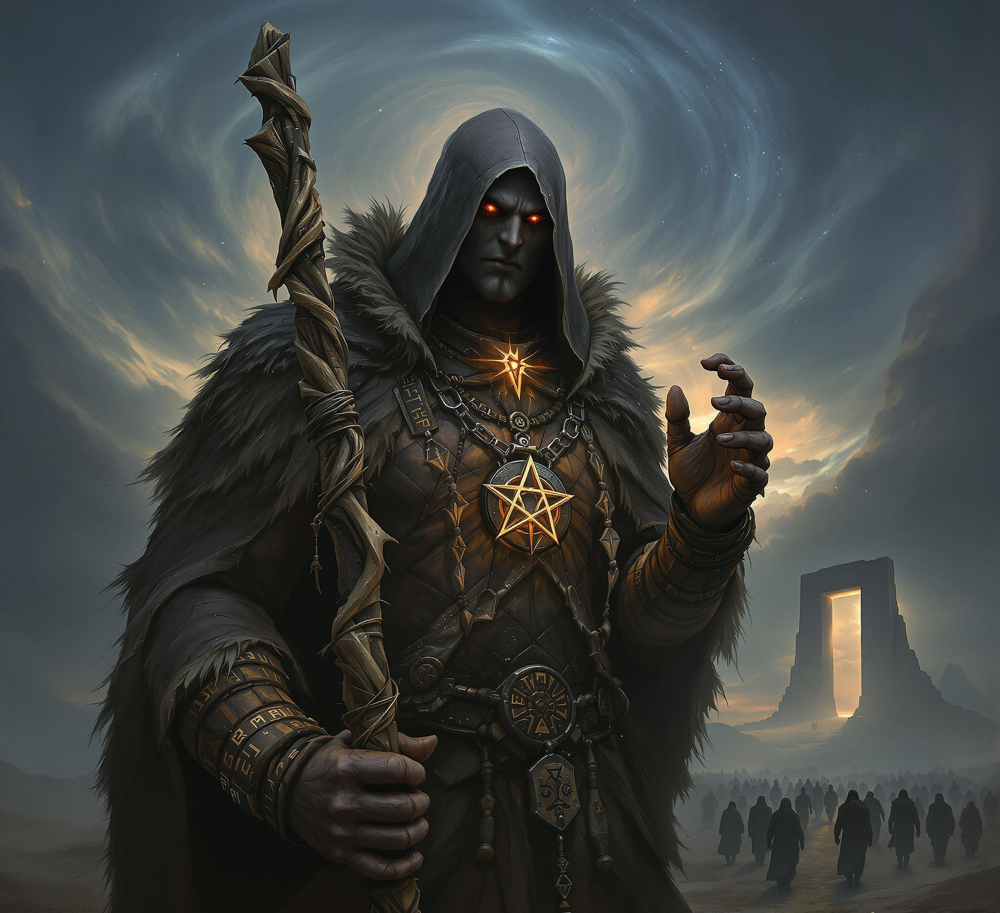
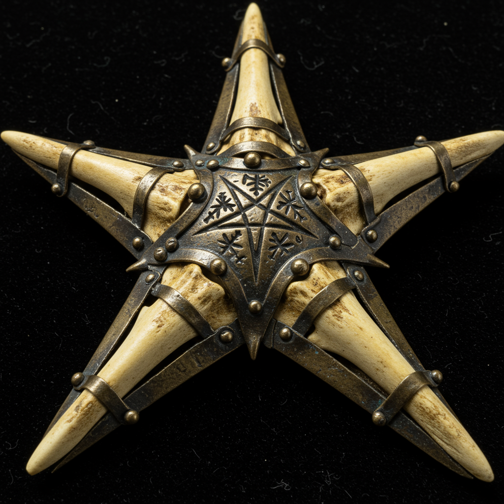
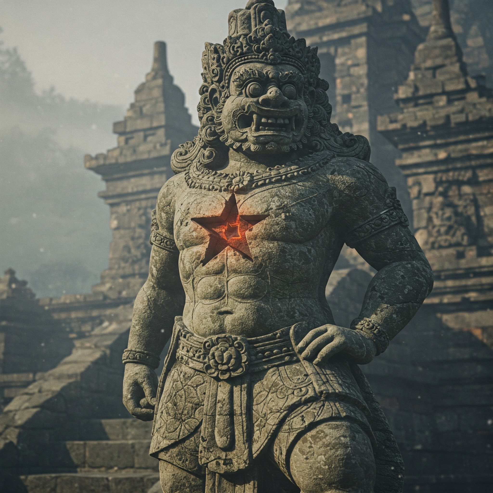
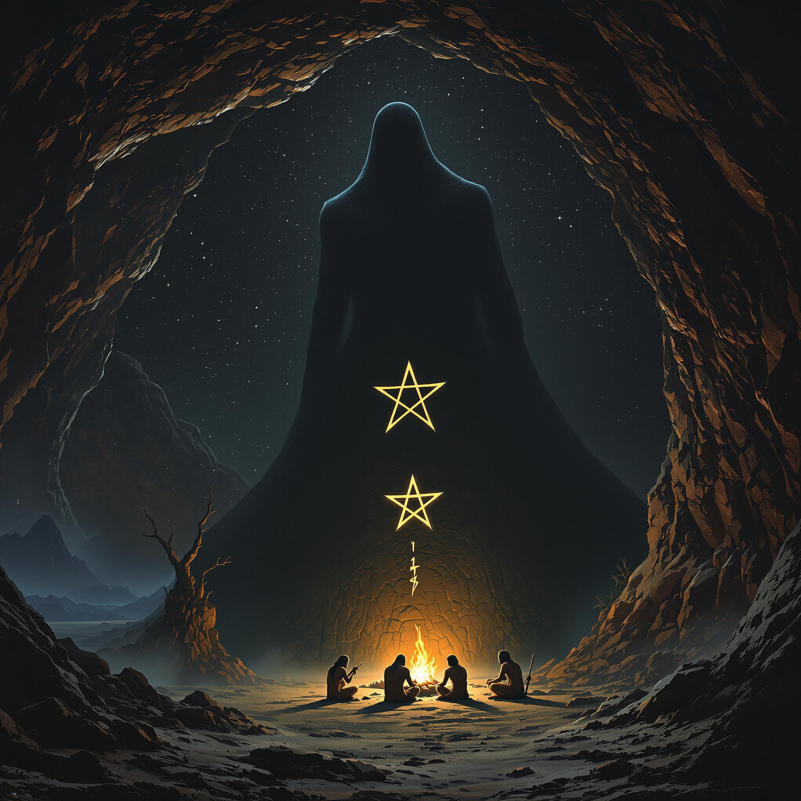

### Portanus (Il Signore delle Porte)
_Divinità pre-romana delle soglie e dei portali_

- **Nome Proto-Indoeuropeo:** _Prtónos_ (ricostruito da _prtu-_ "passaggio, guado" e il suffisso divino _-nos_)
- **Titoli:**
    - _Il Custode delle Soglie_
    - _Signore dei Guadi e delle Porte_
    - _L’Oscuro Viandante_
    - _Colui che Sta tra i Mondi_

**Portanus** è una figura mitologica appartenente al pantheon delle divinità pre-romane, venerata come il _Signore delle Porte_ e dei passaggi tra i mondi. Considerato una delle entità più enigmatiche del periodo italico arcaico, Portanus rappresenta il dominio delle soglie fisiche e metafisiche, fungendo da guardiano tra il mondo dei vivi e quello dei morti, tra il terreno e il divino, e tra dimensioni parallele.

#### **Etimologia e origine**

Il nome "Portanus" deriva dal latino _porta_, che significa "porta" o "passaggio," e richiama il suo ruolo di custode. Alcuni studiosi lo considerano una figura ancestrale da cui potrebbe aver tratto ispirazione il più noto Giano (_Ianus_), sebbene Portanus possieda una connotazione più oscura e misteriosa.

#### **Iconografia e simboli**

Portanus è spesso descritto come una figura incappucciata, avvolta da un mantello scuro che sembra fondersi con le ombre circostanti. Nei rari artefatti attribuiti al suo culto, la sua immagine appare priva di volto, con una chiave in una mano e un'antica lanterna nell'altra, simboli del potere di aprire e chiudere le soglie.
Il suo simbolo è una stella a cinque punte, da ognuna delle punte si diramano tre raggi.
Le cinque punte rappresentano i cinque reami dell'esistenza mentre i tre raggi il passato, il presente e il futuro. 

#### **Poteri e dominio**

Portanus esercita un controllo assoluto sulle porte e sui passaggi, non solo in senso fisico ma anche simbolico.  
Tra i suoi poteri principali:

- **Concedere servitori d'ombra**: Spiriti senzienti o creature fatte d'ombra, spesso utilizzate dai suoi adepti più fedeli come guardiani o emissari.
- **Aprire varchi dimensionali**: È in grado di creare passaggi tra mondi o realtà diverse, un'abilità che i suoi cultisti sfruttano per scopi misteriosi.
- **La manipolazione del tempo e dello spazio**: Nelle sue soglie, le leggi naturali sembrano piegarsi, con il tempo che rallenta, accelera, o si annulla.

#### **Culto e adorazione**

Il culto di Portanus era praticato in segretezza, spesso nelle profondità di grotte, antiche cripte, o luoghi liminali come ponti e porte abbandonate. Gli adepti veneravano Portanus attraverso rituali complessi che includevano l’uso di simboli circolari e chiavi cerimoniali. Si credeva che ogni porta fosse un potenziale altare al dio, e i cultisti si rivolgevano a lui per protezione, per viaggiare oltre i confini naturali, o per evocare i suoi servitori d’ombra.

#### **Impatto culturale**

Portanus è una divinità che rimane poco documentata, ma il suo culto ha lasciato tracce nelle superstizioni romane e medievali. La sua immagine è stata reinterpretata in chiave negativa con l’avvento del Cristianesimo, trasformandolo in un simbolo di pericolo associato ai varchi verso l’ignoto e il proibito.

---

### **Dominio e Ruolo nella Mitologia**

Portanus non era una divinità della creazione o della guerra, ma un’entità legata ai **confini e ai passaggi**:

- Governava i **guadi dei fiumi, le gole montane e le caverne**, che erano visti come porte verso l’ignoto.
- Era il **signore delle soglie tra la vita e la morte**, una guida per le anime dei defunti nel loro cammino verso l’aldilà.
- Controllava il **tempo liminale**, cioè i momenti di transizione tra stagioni, età della vita e stati della coscienza (come sogno e veglia).

Nel culto proto-indoeuropeo, vi era una credenza secondo cui chiunque attraversasse certi luoghi sacri senza il favore di Portanus rischiava di "perdersi" e non ritrovare mai più la strada.

---

### **Iconografia e Simbolismo**

- **La Stella a Cinque Punte con Tre Raggi per Punta:** Questo simbolo potrebbe derivare da antiche incisioni rupestri, rappresentando l'unione tra il mondo dei vivi, il mondo dei morti e un terzo dominio ignoto.
- **Pietre di Confine Sacre:** Le tribù proto-indoeuropee potrebbero aver eretto **stele votive** con il simbolo di Portanus in prossimità di passaggi naturali per chiedere il suo favore.
- **Il Portatore del Fuoco Oscuro:** Portanus potrebbe essere raffigurato come un essere avvolto da un fuoco che non brucia ma oscura la luce, segno del suo potere di nascondere e rivelare.

---

### **Miti e Leggende**

1. **Il Viaggio della Prima Tribù**  
    Si raccontava che la prima tribù degli uomini, nel loro esodo verso nuove terre, si trovò bloccata davanti a un fiume impetuoso. Portanus apparve come un uomo avvolto nell'ombra, indicando un guado nascosto. In cambio, pretese che il primo nato dopo il passaggio fosse a lui consacrato. La tribù accettò e attraversò il fiume, ma al ritorno scoprì che il bambino era sparito senza lasciare traccia.
    
2. **Le Porte Invisibili**  
    Alcuni miti narravano dell’esistenza di porte invisibili, accessibili solo in certi momenti (come l’alba e il tramonto). Chi passava per errore attraverso una di queste porte si trovava in un mondo senza tempo, popolato da ombre che parlavano con voci dimenticate. Solo chi conosceva il vero nome di Portanus poteva tornare indietro.
    
3. **Il Custode del Sole Morente**  
    Si diceva che Portanus fosse colui che raccoglieva il sole morente ogni sera per portarlo nell'aldilà e riconsegnarlo all’alba. In certe notti d’inverno, però, Portanus si rifiutava di restituire il sole, costringendo gli uomini a bruciare fuochi rituali per convincerlo a riaprire la porta del giorno.
    

---

### **Culto e Rituali**

- **Sacrifici di Ombra:** Alcuni rituali prevedevano di bruciare oggetti personali in luoghi sacri affinché l’ombra di quegli oggetti passasse nel regno di Portanus.
- **Pellegrinaggi Notturni:** Alcune tribù compivano viaggi notturni attraverso gole e caverne, credendo che camminare al buio con il favore di Portanus li avrebbe resi invisibili agli spiriti maligni.
- **Il Rito del Passaggio:** I giovani che diventavano adulti dovevano attraversare un guado o una caverna al tramonto, lasciando dietro di sé un’offerta affinché Portanus li riconoscesse come nuovi viaggiatori tra i mondi.

---

### **Declino del Culto**

Col passare dei secoli, mentre le popolazioni proto-indoeuropee si frammentavano e le religioni si evolvevano, Portanus fu assorbito o dimenticato:

- In alcune culture diventò una divinità minore legata ai confini e ai crocevia.
- In altre fu demonizzato come un'entità oscura che tentava i viaggiatori a perdersi nel mondo dei morti.
- Solo il culto sotterraneo dei **Custodes Occultorum Transituum** mantenne viva la sua adorazione segreta.

---

### **Conclusione**

Il culto di Portanus si sarebbe diffuso tra le popolazioni migratorie, plasmando i primi concetti religiosi di **soglia, confine e transizione**. Forse il motivo per cui il suo nome è quasi scomparso è proprio perché i suoi fedeli non volevano che fosse ricordato dagli estranei.

---

### **Evoluzione del Mito di Portanus in India**

#### **Periodo Vedico (circa 1500-500 a.C.)**

Nella fase più antica della religione vedica, la figura di Portanus si è trasformata in una divinità legata ai passaggi tra i mondi e alla transizione tra vita e morte, concetti che troviamo già in alcune divinità vediche. Due sono stati gli adattamenti:

- **Pūṣan**, il dio vedico dei viandanti e delle strade, guida le anime nell'aldilà e protegge chi attraversa territori pericolosi ha assorbito parte del mito di **Portanus**.
- **Yama**, il dio della morte e primo mortale a raggiungere il regno dei defunti, ha acquisito tratti della divinità legata alle soglie e ai confini.

#### **Periodo Brahmanico e Sviluppo dell'Induismo**

Con il tempo, la figura di Portanus è stata assimilata a concetti più complessi, come quelli di **tirtha**, i luoghi di passaggio sacri tra il mondo umano e quello divino, e il concetto di **moksha**, la liberazione dal ciclo delle rinascite (saṃsāra), che è in sé una sorta di "ultima soglia" da attraversare.

In questo periodo, la sua figura si è frammentata in diverse divinità o aspetti di divinità già esistenti:

- **Dvārapālas**, i guardiani delle soglie dei templi indù e buddhisti, come un'eco degli antichi Custodi della Porta.
- **Shiva** nella sua forma di **Kala Bhairava**, il feroce signore del tempo e delle transizioni, che presiede i luoghi di cremazione e le soglie tra vita e morte, potrebbe aver assorbito il lato più occulto del mito.

#### **Persistenza nei Testi e nei Culti Esoterici**

Alcune tradizioni tantriche o ascetiche hanno potuto mantenere il culto in forme più segrete, attribuendo a Portanus un aspetto legato ai passaggi mistici e ai poteri che derivano dall'attraversamento di stati alterati di coscienza. In alcune scuole tantriche, la meditazione su porte e soglie è un simbolo del passaggio tra realtà differenti, concetto che rispecchia il mito originale.

### **Connessione tra le Due Tradizioni**

Mentre in Occidente Portanus è stato assorbito dalla religione romana e poi dimenticato, in India la sua eredità potrebbe essere sopravvissuta sotto forma di pratiche rituali legate ai passaggi tra mondi, ai portali sacri e ai guardiani delle soglie, influenzando la concezione delle porte sacre nei templi e il simbolismo della liberazione spirituale.

# **Portanus: Il Primo Guardiano dei Confini**

 Nei tempi in cui **gli antenati dell’uomo sedevano attorno ai fuochi**, guardando con sospetto l’oscurità della notte, vi era già **qualcosa che stava nell'ombra**, osservando. **Le caverne erano portali, le gole oscure segreti proibiti, le grandi rocce erette sentinelle di un potere ignoto**.

I primi umani parlavano a gesti, poi con suoni appena articolati. **Ma alcuni suoni erano proibiti**. Alcune parole non dovevano essere pronunciate, perché **aprivano le Vie Profonde**. La leggenda narra che **fu il primo sciamano**—colui che sapeva leggere i segni degli antenati e comunicare con il mondo invisibile—a **incontrarlo per la prima volta**.

Non aveva ancora un nome, ma **già esisteva prima delle parole**. Lo sciamano lo vide mentre attraversava la fenditura tra due rocce sacre, quando la luna era nuova. **Era alto, più alto di qualsiasi uomo, e la sua ombra si contorceva come se fosse viva**.

Egli sussurrò **parole sconosciute**, e il suolo si aprì sotto di lui, rivelando un luogo che non apparteneva a questo mondo. Il primo sciamano tentò di fuggire, ma **la creatura lo marchiò**, imprimendogli sul petto il segno della **stella a cinque punte**, simbolo del passaggio eterno. **Da quel giorno, coloro che sognavano il simbolo sapevano che erano destinati a viaggiare tra i mondi**.

Il culto di Portanus nacque **prima delle civiltà, prima della scrittura**, tramandato da racconti sussurrati tra i fuochi notturni. I primi uomini scolpirono **segni sulle pietre**, credendo che potessero tenerlo lontano, ma le **porte si aprivano comunque**, nei momenti in cui la realtà si assottigliava.

Con il tempo, gli uomini impararono a chiamarlo **Signore delle Fenditure, Guardiano delle Pietre Erette, il Senza-Volto che Veglia sui Confini**. I suoi fedeli lo cercavano, **sperando di attraversare le soglie verso i regni sconosciuti**, mentre altri lo temevano, pregando di non udire **il suo sussurro nel vento tra le rocce**.

### **Simbolismo e Tradizione**

- Le **gole e le caverne profonde** erano considerate sue dimore.
- I **cerchi di pietre**—precursori dei dolmen e dei menhir—erano tentativi di chiudere i passaggi che conducevano alle Vie Profonde.
- Il **segno della stella a cinque punte** compare tra le incisioni più antiche, legato ai primi riti tribali.
- Gli **sciamani portavano amuleti di ossa e pietra**, credendo che potessero placare Portanus o permettere di attraversare le soglie in sicurezza.
- Durante **eclissi e lune nuove**, si raccontava che i più sensibili potessero udire il suo richiamo.

---